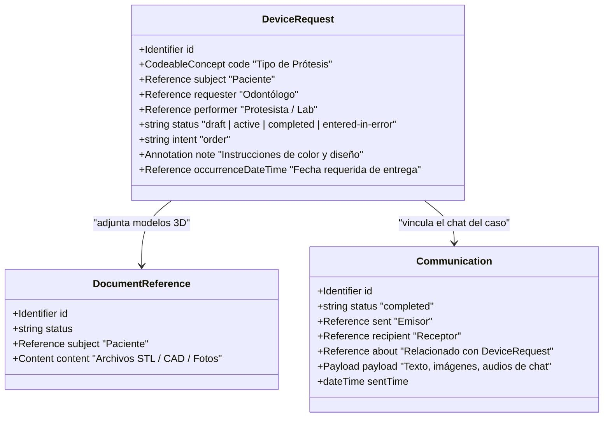
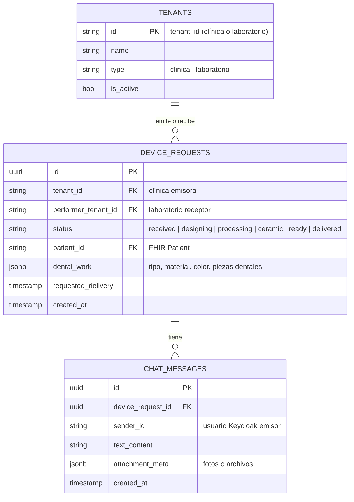
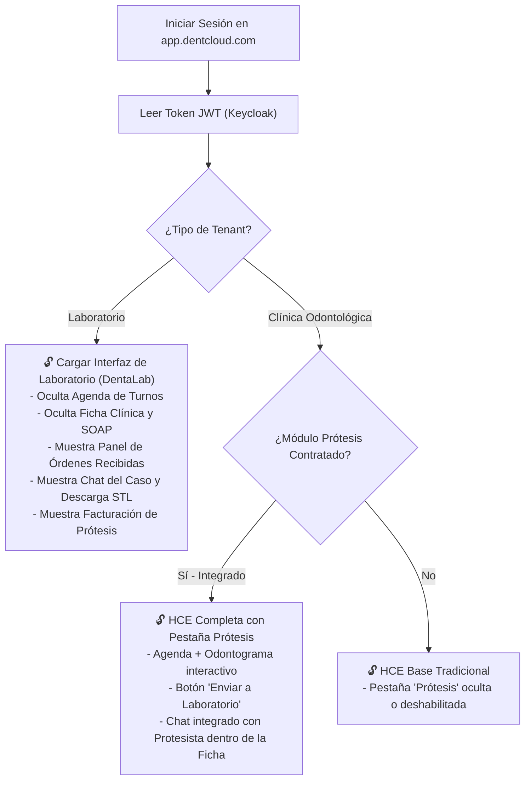

# Diseño Arquitectónico y Estrategia de Implementación — Módulo para Protesistas Dentales (DentaLab / ProtesisChat)

> **Estado:** Propuesta de Diseño · **Fecha:** 2026-06-15
> **Idioma:** Español (Obligatorio por gobernanza)
> **Autor:** Orquestador (Gemini)

---

## 1. Introducción y Contexto del Negocio

El **protesista dental (laboratorio dental)** es un actor clave en el ecosistema de la salud odontológica. Trabaja a partir de órdenes de trabajo (prescripciones de dispositivos médicos/prótesis) enviadas por odontólogos y clínicas. 

### Objetivos del Módulo
1. **Digitalizar la Orden de Trabajo de Prótesis:** Reemplazar el papel físico (ficha de pedido de prótesis) por una orden digital estructurada que detalle tipo de prótesis, piezas implicadas, material, color, y archivos adjuntos (escaneos 3D STL/CAD, fotos).
2. **Canal de Comunicación Bidireccional (Chat):** Un chat seguro y dinámico estilo WhatsApp para coordinar el caso, enviar fotos del avance de la cocción, resolver dudas sobre el margen de tallado, etc.
3. **Flujo de Trabajo del Laboratorio:** Seguimiento de estados (Recibido → Diseño CAD → Procesando/Fresa → Cerámica/Pulido → Control de Calidad → Listo para Enviar → Entregado).
4. **Comercialización Flexible:**
   * **Modo Aislado (SaaS para Laboratorios):** El laboratorio lo contrata para gestionar sus clientes (odontólogos externos), órdenes y chat, sin necesidad de usar DentHCE.
   * **Modo Integrado (DentHCE + Protesis):** Integración nativa. El odontólogo prescribe desde la ficha clínica del paciente y el laboratorio recibe el pedido al instante en su portal.
   * **Modo WhatsApp Integrado (CliniChat):** Automatizaciones para notificar estados a odontólogos y alertas de turnos de prueba a pacientes.

---

## 2. Análisis del Estándar Clínico (HL7 FHIR R4)

Para mantener la conformidad del repositorio con el estándar internacional de salud digital, el módulo utilizará los siguientes recursos de FHIR R4:

1. **`DeviceRequest` (Prescripción de Dispositivo):** Es el recurso oficial FHIR para prescribir un dispositivo hecho a medida (prótesis fija, removible, implante, perno corona, placa de miorelajación).
2. **`DocumentReference` (Referencia a Documento):** Mapea los archivos adjuntos como escaneos intraorales 3D (.STL, .PLY, .OBJ), proyectos de exocad (.dentalCAD) e imágenes de la boca del paciente.
3. **`Communication` (Comunicación Clínica):** Representa cada mensaje enviado en el chat seguro entre el odontólogo y el protesista.

---

## 3. Opciones de Arquitectura y Camino de Implementación

Presentamos las dos opciones técnicas viables para construir este producto, analizando sus ventajas, costos y viabilidad comercial.

### Comparativa de Alternativas

| Característica | Opción A: Microservicio / Carpeta Independiente | Opción B: Monolito Modular SaaS (Recomendada) |
| :--- | :--- | :--- |
| **Tecnología** | Cloudflare Workers + Supabase (igual a CliniChat). | Módulo NestJS backend (`/odontology/protesis`) + Rutas frontend React. |
| **Bases de Datos** | Supabase PostgreSQL independiente. | Base de datos PostgreSQL central de la HCE. |
| **Integración con HCE** | Mediante API REST externa y tokens de Keycloak (complejidad alta de red). | Nativa, directa y transaccional mediante la misma DB (seguridad instantánea). |
| **Aislamiento de Datos** | Total por base de datos física. | Lógico mediante `tenant_id` y RLS a nivel de aplicación/PostgreSQL. |
| **Venta Individual** | Muy sencilla de empaquetar y aislar. | Se habilita creando un tenant de tipo "Laboratorio" que solo tiene acceso a sus vistas de prótesis. |
| **Costos de Infraestructura** | Altos (múltiples bases de datos, dominios y servidores). | Bajos (reutiliza la base de datos y backend de AWS de la HCE). |
| **Mantenimiento y Git** | Dos repositorios o monorrepo complejo con múltiples configuraciones. | Único monorrepo, código ordenado por carpetas e inyección de dependencias. |

---

## 4. Diseño de la Solución Recomendada (Opción B: Monolito Modular SaaS)

Recomendamos la **Opción B** porque permite la mayor velocidad de desarrollo, elimina la latencia de llamadas de red inter-servicios y aprovecha al máximo el motor SaaS multi-tenant y la seguridad de Keycloak que ya construimos.

### Arquitectura Conceptual de Datos (PostgreSQL)

### Flujo de Operación y Roles
1. **El Protesista como Tenant:** Cada laboratorio es registrado en la plataforma como un tenant independiente con tipo `"laboratorio"`.
2. **Relación Comercial:** El panel Super Admin de DentHCE o un sistema de invitaciones vincula la clínica del odontólogo con el laboratorio del protesista.
3. **El flujo de la orden:**
   * El odontólogo abre el paciente, va a la pestaña "Prótesis", crea un `DeviceRequest` asociando el laboratorio elegido y adjuntando archivos STL.
   * El laboratorio recibe una notificación instantánea (o WhatsApp si está contratado CliniChat) y la orden aparece en su bandeja de entrada.
   * El protesista cambia el estado (ej: a "Diseño CAD"). El odontólogo puede ver la actualización y chatear en tiempo real sobre la misma orden.

---

## 4.b Profundización en la Opción B: Integrado Modular (Monolito SaaS)

La **Opción B (Integrado Modular)** propone que el módulo de protesistas comparta el mismo codebase backend (`hce-backend` en NestJS) y frontend (`hce-frontend` en React) que el sistema de Historia Clínica, pero estando **estrictamente aislado a nivel lógico y de permisos**.

A continuación se detalla cómo logramos que funcione como una aplicación "independiente" para quienes contraten solo ese módulo, o como un flujo "100% fluido" para quienes lo compren integrado.

### 1. Aislamiento Lógico de Datos (Zero-Trust)
Aunque odontólogos y laboratorios compartan la misma base de datos física PostgreSQL, **no hay filtración de información médica sensible**.
* **Filtro Cruzado de Tenancy:** Las tablas `device_requests` y `chat_messages` poseen dos columnas de tenencia: `tenant_id` (clínica dental creadora) y `performer_tenant_id` (laboratorio dental receptor).
* **Restricción de Acceso:** El backend inyecta automáticamente en las consultas SQL de base de datos un filtro según el rol y el tenant del usuario:
  * Si el usuario pertenece a una **clínica**: las consultas filtran por `tenant_id = user.tenant_id`.
  * Si el usuario pertenece a un **laboratorio**: las consultas filtran por `performer_tenant_id = user.tenant_id`.
  * El laboratorio **solo tiene acceso de lectura** a los datos de filiación del paciente que viajan *estrictamente* dentro del recurso `DeviceRequest` (Nombre, edad, odontograma del trabajo). No tiene permisos para consultar la ficha clínica general, diagnósticos SOAP, ni antecedentes del paciente en la base de datos principal de la clínica.

### 2. Gestión de Usuarios y Roles en Keycloak
Definimos nuevos roles de Keycloak a nivel de Realm:
* **`laboratorio-operador`**: Acceso al listado de trabajos recibidos, cambiar estados (ej. "en cerámica") y chatear con el odontólogo.
* **`laboratorio-admin`**: Administrador del laboratorio. Además de lo anterior, gestiona el personal (ayudantes de laboratorio), edita datos de facturación y configura precios.
* El JWT (Token) de Keycloak para estos usuarios contiene el atributo `tenant_type: "laboratorio"`.

### 3. Frontend React Dinámico y Feature Flags (Samsung Health Style)
En el frontend, la aplicación detecta el tipo de tenant y los entitlements (módulos habilitados) mediante el endpoint de configuración inicial.

* **Para el Protesista que compra el producto "Solo":** Su experiencia de usuario es la de una aplicación dedicada 100% a laboratorios. No verá rastros de la historia clínica, ni de odontogramas, ni de salas de espera, ya que el componente principal de React renderiza únicamente el dashboard de laboratorios bajo el path `/laboratorio/*`.
* **Para el Odontólogo en el modo "Integrado":** En lugar de tener que abrir otra pestaña o loguearse en otro sistema externo, ve el portal de comunicación directamente en la pestaña "Prótesis" dentro de la ficha de su paciente.

### 4. Ventajas de Desarrollo y Operaciones
* **Cero Latencia en Sincronización:** En la Opción A, si el dentista crea una orden, hay que mandar un Webhook HTTP al microservicio y esperar a que responda. En la Opción B, se realiza un INSERT directo en la base de datos mediante una transacción atómica local.
* **Mantenimiento Simplificado:** Reutilizamos los mismos componentes responsivos ya diseñados en el sistema (botones, inputs, modales, alertas, temas de color claros/oscuros, componentes del chat y carga de archivos a local/S3).
* **Facturación Unificada:** El Super Admin gestiona las licencias de todas las clínicas y laboratorios desde el panel cross-tenant que ya construimos en el modulo `superadmin`.

---

## 5. Caso de Uso de WhatsApp e Integración con CliniChat

El módulo de protesistas se beneficia enormemente si se comercializa junto a **CliniChat (WhatsApp)**:
* **Para el Odontólogo:** Alertas automáticas en WhatsApp cuando el laboratorio cambia el estado de la prótesis (ej. "Su orden #1234 ha sido despachada por el laboratorio").
* **Para el Protesista:** Un bot de WhatsApp que le permita a los protesistas y odontólogos interactuar con el estado de las órdenes sin entrar a la web (ej: "Estado de orden 105" → Bot responde: "Diseño CAD finalizado, en espera de material").
* **Para el Paciente:** Cuando la prótesis llega a la clínica, CliniChat envía un WhatsApp automático al paciente: "Hola Juan, recibimos tu prótesis dental. Agendemos tu cita de prueba aquí...".

---

## 6. Siguientes Pasos y Cuestiones Abiertas para el Super Admin

Para iniciar el desarrollo, requerimos definir tres decisiones de diseño con el Super Administrador:

> [!IMPORTANT]
> **Preguntas clave para el Super Administrador (Dr. Julio):**
> 1. **Definición de Carpeta y Estructura:** ¿Prefiere crear una carpeta independiente en la raíz (Opción A) manteniendo el código 100% aislado pero duplicando infraestructuras, o prefiere implementarlo como un módulo de NestJS/React integrado y protegido por feature flags (Opción B)?
> 2. **Visor de Archivos 3D (STL):** Dado que los protesistas y odontólogos trabajan con archivos STL (escaneos dentales 3D), ¿es prioridad que implementemos un visor de STL interactivo en 3D en el chat (usando Three.js) para que puedan rotar y ver el molde directamente en pantalla, o inicialmente solo permitimos descargas?
> 3. **Gestión de Cuentas y Cobros:** ¿El módulo de protesistas debe incluir facturación básica (llevar la cuenta corriente de cuánto le debe cada clínica al laboratorio por mes) o inicialmente solo se enfocará en órdenes de trabajo y comunicación/chat?
