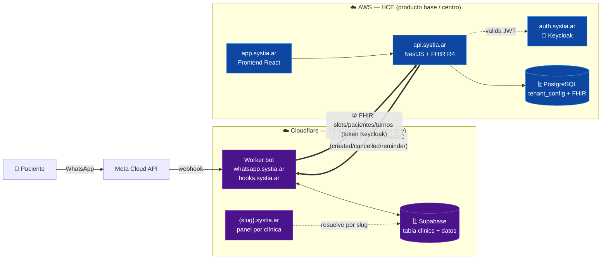
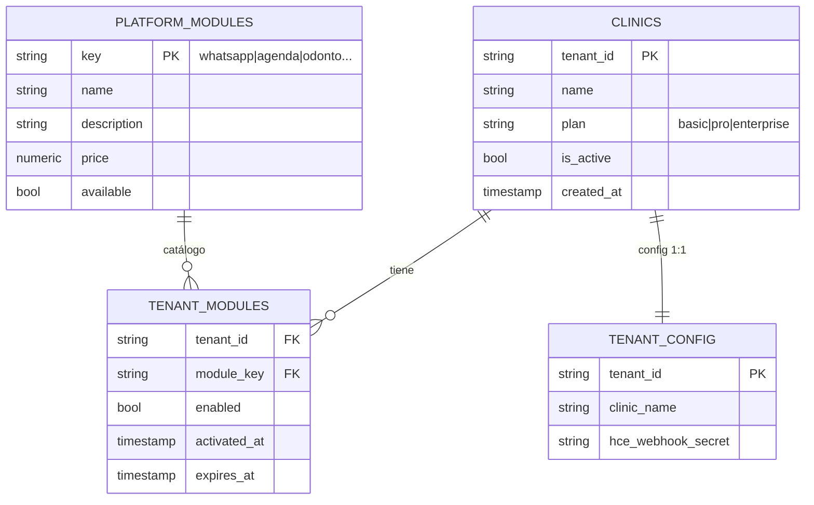
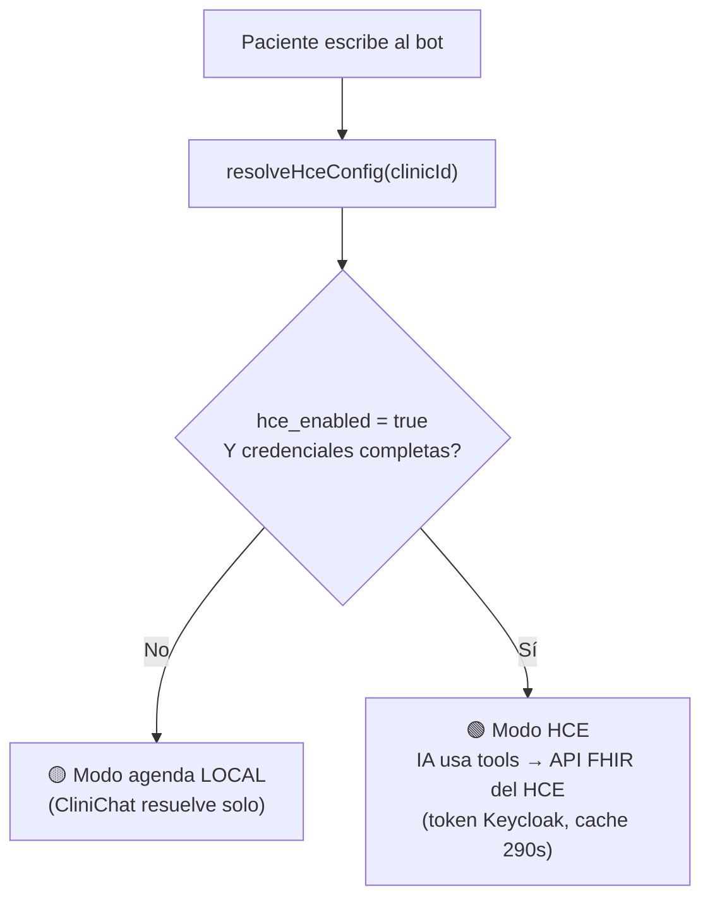
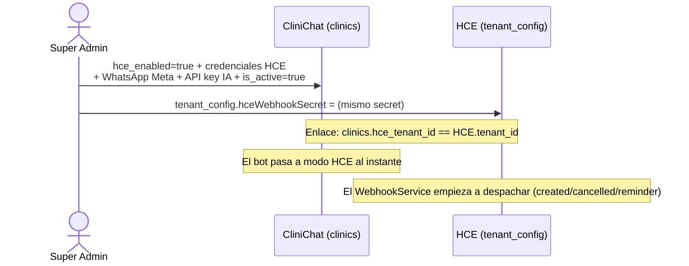
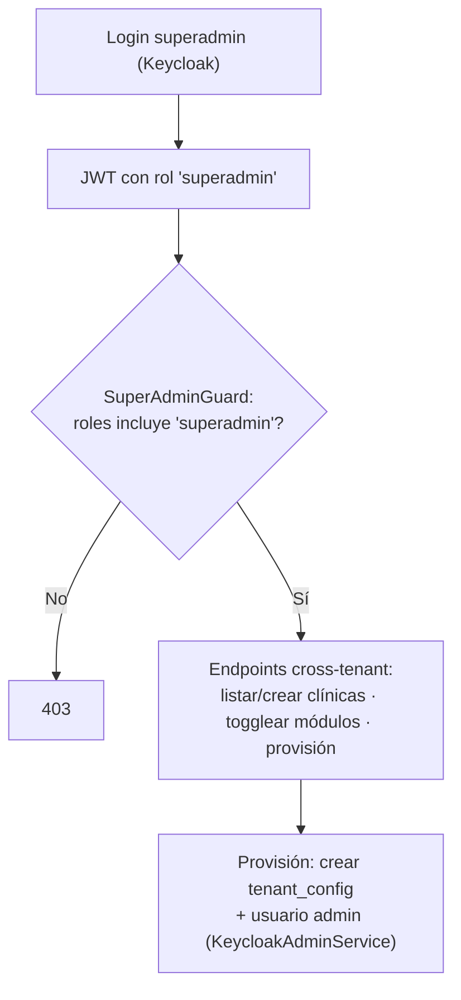
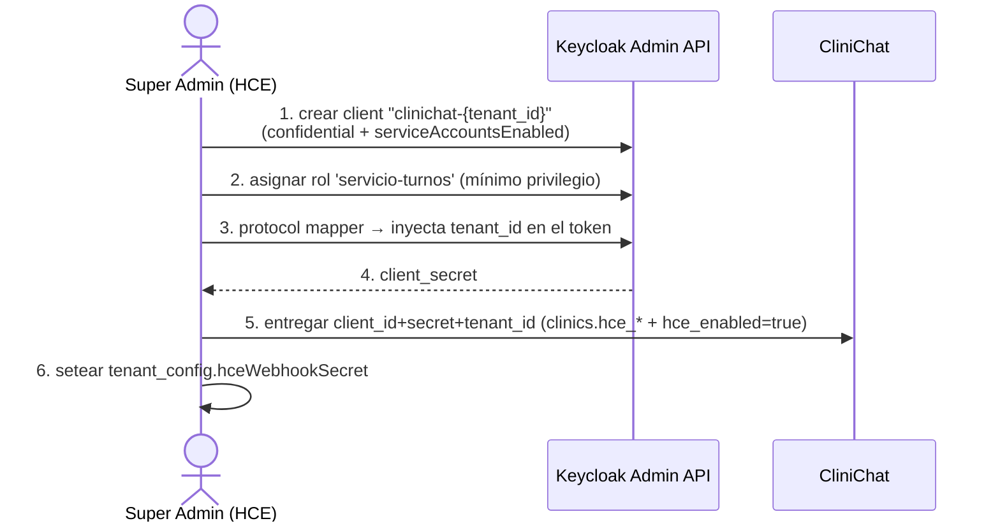

# Super Admin y Servicios Anexables — Documento de Funcionamiento

> **Estado:** Análisis / Diseño (no implementado en el HCE) · **Fecha:** 2026-06-13 · **Autor:** Orquestador
> **Visión:** El **HCE es el producto base**. Los demás productos (CliniChat/WhatsApp, etc.) son **servicios que se anexan** a una clínica **solo si la clínica los contrató**. Este documento explica cómo funcionan ambos mundos hoy y cómo se construirá el Super Admin del HCE para anexar/dar de baja servicios desde un punto único.
>
> Los diagramas son **Mermaid**. Para verlos renderizados: VS Code con "Markdown Preview Mermaid Support" o pegar en https://mermaid.live. Este es un **documento vivo**: se actualiza con cada pieza que construimos.

---

## 1. Topología — los dos mundos en `systia.ar`



| Host | Es | Stack |
|---|---|---|
| `app/api/auth.systia.ar` | **HCE** (base) | React · NestJS+FHIR · Keycloak (AWS) |
| `whatsapp.systia.ar` / `hooks.systia.ar` | **CliniChat** (servicio) | Cloudflare Worker + Supabase |
| `{slug}.systia.ar` | Panel por clínica de CliniChat | resuelto por subdominio |

---

## 2. Modelo de datos — comparación (verificado en código)

### 2.1 CliniChat (Supabase) — YA tiene multi-tenant + planes + flags
Tabla maestra **`clinics`**:
- `id`, `name`, `slug` (→ subdominio), `is_active`
- **`plan`** `CHECK IN ('basic','pro','enterprise')`
- Credenciales WhatsApp Meta: `whatsapp_phone_number_id`, `_access_token`, `_verify_token`, `_app_secret`
- Config IA: `ai_provider`, `ai_model`, `ai_api_key`
- **Integración HCE (flag + credenciales):** `hce_enabled` (bool), `hce_fhir_base_url`, `hce_keycloak_token_url`, `hce_keycloak_client_id`, `hce_keycloak_grant_type`, `hce_keycloak_client_secret`/`_username`/`_password`, `hce_tenant_id`, `hce_webhook_secret`
- `clinic_id` propagado a todas las tablas de datos (RLS por tenant).
- Super Admin: flag **`profiles.is_superadmin`**.

### 2.2 HCE (PostgreSQL) — estado actual
- **No hay tabla maestra de clínicas.** El tenant es solo un `tenant_id` (string) en el JWT de Keycloak + una fila en **`tenant_config`** (branding, doctor, horarios, `hceWebhookSecret`).
- Roles Keycloak: `medico`, `enfermero`, `recepcionista`, `administrador`, `paciente`. **No existe `superadmin`.**
- **No hay** `plan` ni catálogo de módulos contratados.
- `KeycloakAdminService.createUser(...)` ya crea usuarios con su `tenant_id` (reutilizable para provisión).

### 2.3 HCE — modelo propuesto (a construir)

> Alternativa simple (estilo CliniChat): en vez de `platform_modules`+`tenant_modules`, un campo `enabled_modules JSONB` en `clinics`/`tenant_config`. Decisión pendiente (§6).

---

## 3. Ciclo de vida del servicio WhatsApp (el caso de referencia)

### 3.1 Cómo el bot decide usar el servicio (gate verificado)
`whatsapp-conversation.ts` → `resolveHceConfig(clinicId)` (en `hce-client.ts`):



### 3.2 ANEXAR el servicio a una clínica


### 3.3 DAR DE BAJA el servicio
```mermaid
sequenceDiagram
    actor SA as Super Admin
    participant CC as CliniChat
    participant HCE as HCE
    SA->>CC: hce_enabled=false (y/o is_active=false)
    Note over CC: Bot vuelve a modo local; sync-appointment responde 403 "Integración desactivada"
    SA->>HCE: limpiar hceWebhookSecret
    Note over HCE: WebhookService deja de despachar
```

**Puntos de control verificados** (dónde se "enciende/apaga" el servicio):
| Lugar | Efecto |
|---|---|
| `clinics.hce_enabled` (CliniChat) | Interruptor maestro del bot ↔ HCE. `false` → modo local; el webhook entrante da 403. |
| `clinics.hce_*` credenciales | Si falta una, `buildHceConfig` devuelve `null` → servicio inactivo. |
| `clinics.is_active` | Suspende toda la clínica (login + automatización). |
| `tenant_config.hceWebhookSecret` (HCE) | Sin secret, el HCE no despacha webhooks salientes. |

---

## 4. Los dos flujos de turno (cómo opera el servicio una vez anexado)

```mermaid
flowchart TD
    subgraph A["A · Turno nace en WhatsApp (bot → HCE)"]
        a1["Paciente pide turno"] --> a2["Bot identifica por DNI"]
        a2 --> a3["GET /Slot (HCE)"]
        a3 --> a4["POST /Appointment + Idempotency-Key"]
        a4 --> a5["Turno en HCE + espejo en Supabase"]
    end
    subgraph B["B · Turno nace en recepción HCE (HCE → bot)"]
        b1["Recepción carga turno"] --> b2["HCE firma webhook HMAC"]
        b2 --> b3["POST hooks.systia.ar/sync-appointment"]
        b3 --> b4["Valida HMAC + resuelve clínica por hce_tenant_id"]
        b4 --> b5["Espeja turno (idempotente por hce_appointment_id)"]
        b5 --> b6["Recordatorio WhatsApp 24h antes"]
    end
```


> Nota verificada: si el paciente no tiene teléfono en CliniChat, `sync-appointment` responde `patient_phone_not_found` y **no** espeja (no hay a quién recordar). No es error.

---

## 5. Diseño propuesto del Super Admin del HCE

### 5.1 Patrón de seguridad (inspirado en CliniChat, adaptado a Keycloak)
CliniChat valida `profiles.is_superadmin` en cada endpoint sensible (`create-user.ts`). El HCE hará el equivalente con **un rol `superadmin` en Keycloak** + un guard que permita operaciones **cross-tenant** (rompe el aislamiento por tenant a propósito, solo para superadmin).



### 5.1.b Generación del service-account de Keycloak (pieza crítica del anexado)

**Estado actual (verificado):** el realm del HCE solo tiene los clients `hce-app` (público) y `hce-backend` (confidential). **No existe** un service-account por clínica ni el rol `servicio-turnos`. En el test e2e, CliniChat se autenticó con un **workaround**: `hce-app` + **password grant** con un usuario médico real (`doctor_julio`). `KeycloakAdminService` hoy **solo crea usuarios, no clients**.

**Quién genera qué:** CliniChat **no genera** el service-account, lo **consume** — las credenciales se le entregan en el onboarding (hoy, manual). El que debe generarlas es el **HCE** (dueño de Keycloak).

**A construir — al anexar WhatsApp, el Super Admin del HCE genera el service-account vía Keycloak Admin API:**

**Beneficio:** se reemplaza el password grant (expone una cuenta humana) por **client_credentials con rol `servicio-turnos`** (solo Appointment/Patient/Slot, no la HC). Hay que **extender `KeycloakAdminService`** para crear clients + service-accounts + mappers (hoy solo usuarios).

### 5.2 Panel (clonando la UX probada de CliniChat "VoxMed SaaS")
- **Resumen**: métricas globales (clínicas activas/totales, pacientes, turnos).
- **Clínicas**: tabla (nombre, plan, estado, módulos activos) + alta/edición.
- **Módulos**: por clínica, toggles para anexar/dar de baja cada servicio (WhatsApp, etc.).
- **Usuarios**: alta del admin de cada clínica (reusa `KeycloakAdminService`).
- Estética: minimalista DentHCE (Samsung Health) — mockups en prompts de nano banana (§7).

---

## 6. Decisiones tomadas (2026-06-13)

1. **Modelo de módulos:** ✅ **Tablas normalizadas** `platform_modules` (catálogo) + `tenant_modules` (entitlements con `activated_at`/`expires_at`).
2. **Orquestación:** ✅ **HCE orquesta** — al activar un servicio, el HCE llama a una API de CliniChat para setear `hce_enabled`+credenciales. El HCE es el centro.
3. **Service-account:** ✅ **Automatizar** vía Keycloak Admin API (client confidential + rol `servicio-turnos` mínimo privilegio + mapper `tenant_id`).
4. **Estética del panel:** ✅ **DentHCE** (Samsung Health), reusando la estructura/tabs de VoxMed.

---

## 7. Plan de implementación por fases

> **Dependencia inter-repo:** la Fase 4 (orquestación) requiere que **CliniChat** (`clinichat-assistant`) exponga un endpoint para que el HCE configure la integración. Se coordina con ese equipo/repo.

### Fase 1 — Modelo de datos + rol superadmin (fundaciones)
- Extender `tenant_config` (o tabla maestra de clínicas) con `plan` + `is_active`.
- Crear `platform_modules` (catálogo: key, name, description, price, available) y `tenant_modules` (tenant_id, module_key, enabled, activated_at, expires_at). Migración SQL + entidades TypeORM.
- Seed del catálogo: `hc-base`, `agenda`, `whatsapp`, `odontologia-pami`.
- Rol `superadmin` en `hce-realm.json` + `SuperAdminGuard` (permite operaciones cross-tenant).

### Fase 2 — Entitlements + gate de módulos (backend)
- `ModulesService.isEnabled(tenantId, moduleKey)` (consulta `tenant_modules`, respeta `expires_at`).
- Aplicar el gate al servicio WhatsApp: `sendReminder`/webhook rechazan si `whatsapp` no está habilitado (cierra el GAP de [[hce-producto-modular-suscripcion]]).

### Fase 3 — API Super Admin (backend, cross-tenant)
- `GET /api/superadmin/clinics` (listar todas), `POST /api/superadmin/clinics` (provisión: `tenant_config` + admin en Keycloak vía `KeycloakAdminService`).
- `PATCH /api/superadmin/clinics/:tenantId/modules` (activar/desactivar módulo).
- `GET /api/superadmin/metrics` (conteos globales).

### Fase 4 — Service-account Keycloak + orquestación CliniChat
- Extender `KeycloakAdminService`: crear client confidential `clinichat-{tenantId}` + service-account + rol `servicio-turnos` + protocol mapper `tenant_id`; devolver `client_secret`.
- Crear rol `servicio-turnos` en el realm (scope mínimo: Appointment/Patient/Slot).
- Cliente HTTP HCE→CliniChat: al activar `whatsapp`, generar service-account + setear `hceWebhookSecret` + push de credenciales a CliniChat. *(Requiere endpoint en CliniChat.)*

### Fase 5 — Panel Super Admin (frontend React, estética DentHCE)
- Ruta/vista solo para rol `superadmin`. Tabs: Resumen · Clínicas · Módulos · Usuarios.
- Tabla de clínicas, modal crear/editar, **toggles de módulos** (anexar/dar de baja), alta de admin de clínica.

### Fase 6 — Quality Gates + verificación + handoff
- `security-review` (cross-tenant del superadmin, mínimo privilegio del service-account), `code-review`, tests, verificación runtime. Actualizar tablero + walkthrough + memoria.

---

## 7. Mockups (nano banana → correr en Gemini)
Ver prompts entregados para: (1) dashboard listado de clínicas, (2) panel de gestión de módulos con toggles, (3) modal crear clínica. Estética DentHCE: fondo claro, tarjetas 24px, acento `#2962ff`, Samsung Health.

---

## Anexo — referencias de código (verificadas)
- CliniChat: `src/routes/superadmin/dashboard.tsx`, `src/routes/api/superadmin/create-user.ts`, `src/lib/hce-client.ts` (`resolveHceConfig`/`buildHceConfig`), `src/routes/api/public/hooks/sync-appointment.ts`, `src/components/TenantProvider.tsx`, `supabase/migrations/20260601000000_multi_tenant.sql`, `20260605120000_hce_integration_fields.sql`.
- HCE: `hce-backend/src/tenant/keycloak-admin.service.ts`, `users.controller.ts`, `tenant-config.entity.ts`, `auth/roles.guard.ts`, `webhook/webhook.service.ts`.
