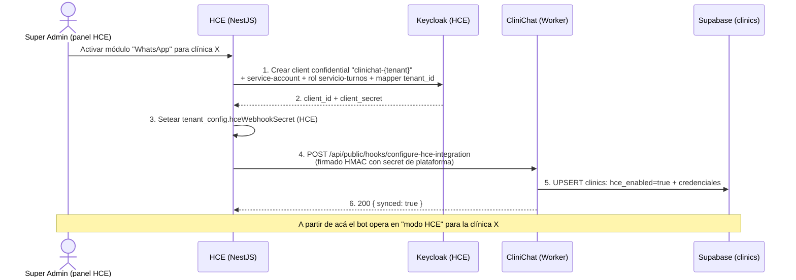

# Handoff a CliniChat — Anexado/Baja de WhatsApp orquestado por el HCE

> **De:** Equipo HCE (AWS · NestJS · FHIR R4 · Keycloak)
> **Para:** Equipo CliniChat (Cloudflare Workers · Supabase)
> **Fecha:** 2026-06-13 · **Estado:** Contrato propuesto para implementar
> **Objetivo:** que **anexar o dar de baja el servicio WhatsApp** a una clínica se haga **desde el panel Super Admin del HCE con un solo botón**, y que el HCE configure automáticamente el lado de CliniChat.

---

## 0. Resumen ejecutivo (qué cambia y por qué)

Hoy, activar la integración HCE↔WhatsApp para una clínica es **manual en los dos lados**: alguien carga a mano el `clinics.hce_enabled = true` y todas las credenciales en Supabase, y el secret del webhook en el HCE. Lo automatizamos:

- **El HCE es el centro (orquesta).** Cuando el Super Admin del HCE activa el módulo "WhatsApp" para una clínica:
  1. El HCE **genera un service-account dedicado en Keycloak** para esa clínica (llave-robot, mínimo privilegio). *(Fase 4A — lado HCE, ya en curso.)*
  2. El HCE **les envía a ustedes** esas credenciales mediante **una sola llamada HTTP** a un endpoint nuevo que deben implementar. *(Fase 4B — lado CliniChat, este documento.)*
- **Lo que les pedimos:** un endpoint que **reciba esa configuración y la persista** en su tabla `clinics` (setear `hce_enabled` + credenciales). Nada más. La generación de la llave y la decisión de "anexar/baja" son nuestras.

> Esto reemplaza el parche actual (el bot autenticándose con la cuenta de un médico real / password grant) por un **service-account `client_credentials` de mínimo privilegio**. Sus campos `clinics.hce_keycloak_grant_type` ya soportan ambos modos, así que el cambio para ustedes es mínimo.

---

## 1. Arquitectura de la unión (quién hace qué)



**Dar de baja** es el mismo flujo pero el paso 4 lleva `action: "disable"` → ustedes setean `hce_enabled = false` (el bot vuelve a modo agenda local al instante).

---

## 2. Lo que ustedes deben implementar — el endpoint receptor

### 2.1 Ruta y método
```
POST https://hooks.systia.ar/api/public/hooks/configure-hce-integration
```
(Respeta su convención de rutas `/api/public/hooks/*`, igual que `sync-appointment`.)

### 2.2 Autenticación — HMAC con **secret de plataforma**
A diferencia de los webhooks de turnos (que firman con el `hce_webhook_secret` *de cada clínica*), esta llamada de **configuración** se firma con un **único secret de plataforma** compartido HCE↔CliniChat (`PLATFORM_SYNC_SECRET`), porque al momento de anexar la clínica todavía no tiene su secret.

- Header: `X-HCE-Platform-Signature: sha256=<hmac_hex>`
- HMAC-SHA256 del **body crudo** con `PLATFORM_SYNC_SECRET`.
- **Reutilizan su función existente** `validateHceWebhookSignature(rawBody, signature, PLATFORM_SYNC_SECRET)` — la misma lógica de `sync-appointment`, solo cambia qué secret usan.
- El `PLATFORM_SYNC_SECRET` lo generamos juntos y lo cargan como variable de entorno del Worker (NO en la tabla `clinics`).

### 2.3 Payload — ANEXAR (`action: "enable"`)
```jsonc
{
  "action": "enable",
  "hce_tenant_id": "clinica_santa_lucia",        // identidad de la clínica en el HCE (obligatorio)
  "clinic_slug": "santalucia",                    // para que ustedes resuelvan/creen la fila clinics
  "clinic_name": "Clínica Santa Lucía",
  "credentials": {
    "hce_fhir_base_url":        "https://api.systia.ar/fhir/r4",
    "hce_keycloak_token_url":   "https://auth.systia.ar/realms/hce-realm/protocol/openid-connect/token",
    "hce_keycloak_client_id":   "clinichat-clinica_santa_lucia",
    "hce_keycloak_grant_type":  "client_credentials",
    "hce_keycloak_client_secret":"<secret generado por el HCE>",
    "hce_webhook_secret":       "<secret compartido para los webhooks de turnos de esta clínica>"
  }
}
```

### 2.4 Payload — DAR DE BAJA (`action: "disable"`)
```jsonc
{
  "action": "disable",
  "hce_tenant_id": "clinica_santa_lucia"
}
```

### 2.5 Lógica que debe ejecutar el endpoint
1. Leer el **body crudo** (bytes) → validar la firma HMAC con `PLATFORM_SYNC_SECRET`. Si no coincide → `401`.
2. Resolver la fila `clinics` destino (ver §3 — decisión a confirmar).
3. Según `action`:
   - **`enable`**: `UPDATE clinics SET hce_enabled = true, hce_fhir_base_url = ..., hce_keycloak_* = ..., hce_tenant_id = ..., hce_webhook_secret = ...` con los valores de `credentials`.
   - **`disable`**: `UPDATE clinics SET hce_enabled = false` (NO borrar credenciales — solo apagar, para poder re-anexar sin re-generar todo).
4. Responder `200 { synced: true, action }`.

### 2.6 Respuestas esperadas
| Situación | HTTP | Body |
|---|---|---|
| Configuración aplicada | 200 | `{ "synced": true, "action": "enable" \| "disable" }` |
| Firma de plataforma inválida | 401 | `{ "error": "Firma inválida" }` |
| Clínica no resuelta | 404 | `{ "error": "Clínica no encontrada" }` |
| Payload inválido (falta `hce_tenant_id`/`action`) | 400 | `{ "error": "..." }` |

---

## 3. Decisión a confirmar entre ambos equipos — ¿cómo resuelven la clínica destino?

El HCE identifica la clínica por `hce_tenant_id`. Ustedes la identifican por `clinics.id` (UUID) o `clinics.slug`. Necesitamos acordar el match. Opciones:

- **(A) Por `clinic_slug`** (recomendada): el HCE envía el slug; ustedes hacen match `WHERE slug = :clinic_slug`. Si no existe, la crean con los datos básicos del payload. Simple y legible.
- **(B) Por `hce_tenant_id`**: ustedes guardan/buscan por `clinics.hce_tenant_id`. Requiere que la clínica ya exista de su lado.
- **(C) La clínica debe pre-existir** en CliniChat (creada por su Super Admin) y esta llamada solo "enciende" la integración (nunca crea filas).

> **Pregunta para ustedes:** ¿la clínica se crea primero en CliniChat (su panel) y el HCE solo la "enciende", o el HCE puede provocar el alta de la fila `clinics`? Esto define si la opción es A (crear-si-no-existe) o C (solo encender).

---

## 4. Lo que NO cambia de su lado
- El flujo de turnos (`sync-appointment`, recordatorios, modo HCE del bot) **sigue igual**. `resolveHceConfig()` ya lee `hce_enabled` + credenciales: en cuanto este endpoint las setea, el bot pasa a modo HCE solo.
- El mapeo género ↔ FHIR, la idempotencia de webhooks, la cache de token Keycloak: **sin cambios**.
- Solo cambia que las credenciales ahora **llegan automáticamente** en vez de cargarse a mano, y que el `grant_type` será `client_credentials` (que ya soportan) en vez del password grant de prueba.

---

## 5. Checklist para el equipo CliniChat
- [ ] Crear el endpoint `POST /api/public/hooks/configure-hce-integration`.
- [ ] Validar la firma HMAC con `PLATFORM_SYNC_SECRET` (reusar `validateHceWebhookSignature`).
- [ ] Implementar `action: enable` (upsert credenciales + `hce_enabled=true`) y `action: disable` (`hce_enabled=false`).
- [ ] Acordar con el HCE la resolución de la clínica destino (§3: slug / tenant_id / pre-existe).
- [ ] Cargar `PLATFORM_SYNC_SECRET` como env var del Worker (lo generamos juntos).
- [ ] Confirmar que `resolveHceConfig()` funciona con `grant_type=client_credentials` + el `client_secret` real (debería, ya está soportado en `hce-client.ts`).
- [ ] Self-test: enviar un `enable` de prueba firmado y verificar que el bot pasa a modo HCE; luego un `disable` y verificar que vuelve a modo local.

---

## 6. Lo que el HCE entrega de su lado (para que sepan con qué contar)
- **Fase 4A (en curso):** generación automática del service-account `clinichat-{tenant}` en Keycloak con rol `servicio-turnos` (mínimo privilegio) + mapper `tenant_id`. El HCE produce `client_id` + `client_secret`.
- **Fase 4B (HCE):** el cliente HTTP que arma el payload de §2.3/§2.4 y llama a su endpoint, firmado con `PLATFORM_SYNC_SECRET`. Se activa al togglear el módulo WhatsApp en el panel Super Admin.
- Documento de referencia completo del diseño: `docs/design/superadmin-servicios-anexables.md` (HCE).

---

## 7. Contacto / siguiente paso
Cuando confirmen la **§3** (resolución de la clínica) y tengamos el `PLATFORM_SYNC_SECRET` acordado, ambos lados quedan listos para el primer anexado automático de punta a punta.
