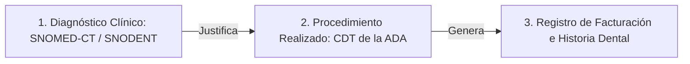

# Mejores Prácticas Clínico-Tecnológicas para la HCE Odontológica

Este documento consolida las directrices y estándares internacionales de la **American Dental Association (ADA)**, **HIPAA** y la **FDIC** para el registro clínico-odontológico digital. Se integra al **Data Lake de Conocimiento** como el corpus de reglas para entrenar y auditar la generación de código y flujos de trabajo clínicos.

---

## 🛡️ 1. Modelo "Diagnóstico Antes del Tratamiento" (Diagnosis-Before-Treatment)

La práctica odontológica administrativa tradicional suele registrar únicamente códigos de procedimiento. Para una HCE de alta calidad, el sistema debe obligar a registrar la justificación clínica antes del procedimiento:

- **SNODENT (Systematized Nomenclature of Dentistry):** Proporciona códigos estandarizados para diagnósticos dentales específicos (ej. *Pulpitis irreversible*, *Caries de esmalte y dentina*, *Gingivitis inducida por placa*).
- **CDT (Current Dental Terminology):** Códigos estándar de la ADA para facturación y reporte de procedimientos (ej. *D3300 - Endodoncia canal anterior*, *D1110 - Profilaxis adulto*).
- **Regla del Data Lake:** Cada recurso `Procedure` (FHIR) debe contener un enlace obligatorio a un diagnóstico clínico `Condition` (FHIR) codificado en SNOMED-CT/SNODENT.

---

## 📊 2. El Periodontograma Digital e Interoperable

A diferencia del odontograma que evalúa la estructura dental, el periodontograma mide la salud del tejido de soporte (encía y hueso alveolar). Las mejores prácticas exigen registrar:

1. **Profundidad de Sondaje (Probing Depth):** 6 puntos de medición por pieza dental (mesio-vestibular, vestibular, disto-vestibular, mesio-lingual, lingual, disto-lingual).
2. **Nivel de Inserción Clínica (NIC):** Cálculo automático cruzando la profundidad de sondaje y la posición del margen gingival.
3. **Sangrado al Sondaje (BOP):** Indicador crítico de inflamación activa.
4. **Movilidad Dentaria y Compromiso de Furca:** Grados I, II o III para evaluar el pronóstico de la pieza.
- **Mapeo FHIR:** Los datos del periodontograma se registran como recursos `Observation` (FHIR) con códigos específicos **LOINC** para mediciones periodontales.

---

## ✍️ 3. Registro Contemporáneo y Consentimiento Informado Inmutable

- **Documentación Contemporánea (Real-Time):** Las notas SOAP y actualizaciones de odontogramas deben registrarse "al lado del sillón" (*chairside*) de forma inmediata tras el encuentro clínico.
- **Firma Digital Inmutable (Audit Trail):** Cada cambio en el odontograma o nota SOAP genera una versión firmada criptográficamente por la clave del odontólogo (Keycloak OIDC JWT). Los registros no se borran; se crean nuevas versiones inmutables (recurso `AuditEvent` de FHIR).
- **Consentimiento Informado Electrónico:** Procedimientos complejos (como implantes, endodoncias y cirugías maxilofaciales) exigen un consentimiento firmado digitalmente por el paciente en la tableta/pantalla táctil del odontólogo antes de habilitar el guardado del tratamiento en la HCE.

---

## 💊 4. Prescripción Segura y Alertas Médicas Cruzadas

El motor de reglas de soporte para decisiones clínicas (CDS Hooks) debe verificar activamente el historial del paciente:
- **Anestésicos Locales y Comorbilidades:** Alertas al seleccionar anestésicos con vasoconstrictores (Lidocaína con Epinefrina) en pacientes con antecedentes registrados de hipertensión arterial descontrolada o arritmias.
- **Alergias a Materiales Dentales:** Validación cruzada de alergias registradas al látex, níquel o resinas acrílicas antes de programar ortodoncias o prótesis.
- **Uso Racional de Antibióticos:** Limitar la prescripción de antibióticos sistémicos en endodoncias no complicadas, recomendando analgésicos de primera línea.

---

## 📄 5. Retención y Seguridad de Datos Clínicos

- **Multi-tenant estricto:** Absoluta separación lógica de datos mediante identificadores de inquilino (`tenantId`) en todas las consultas del Data Lake, evitando el acceso cruzado accidental entre profesionales.
- **Cumplimiento legal de retención:** Resguardos automatizados con encriptación en reposo y políticas de retención de historias clínicas de acuerdo a normativas locales (usualmente 10 años desde el último encuentro).
