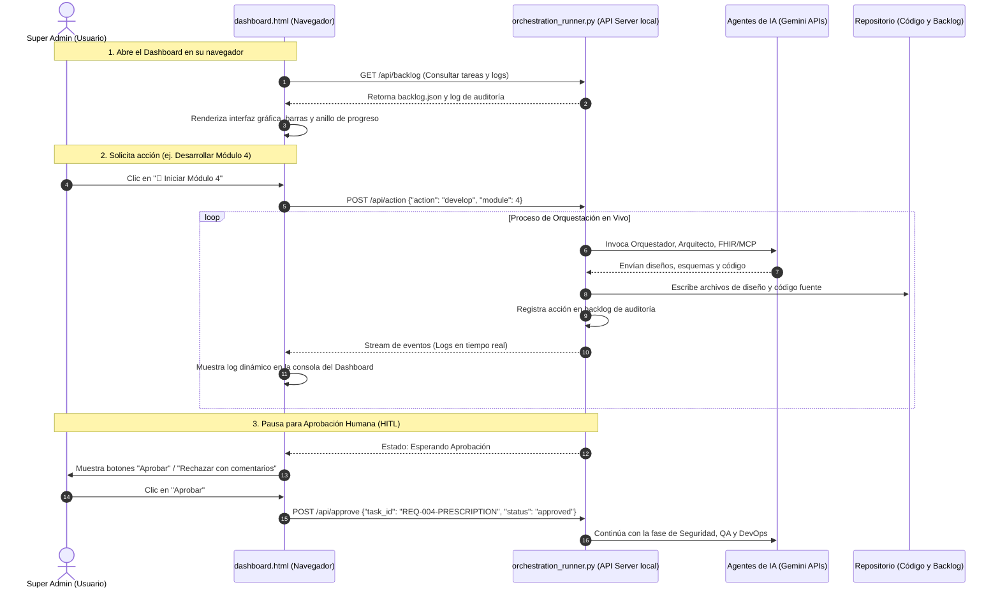
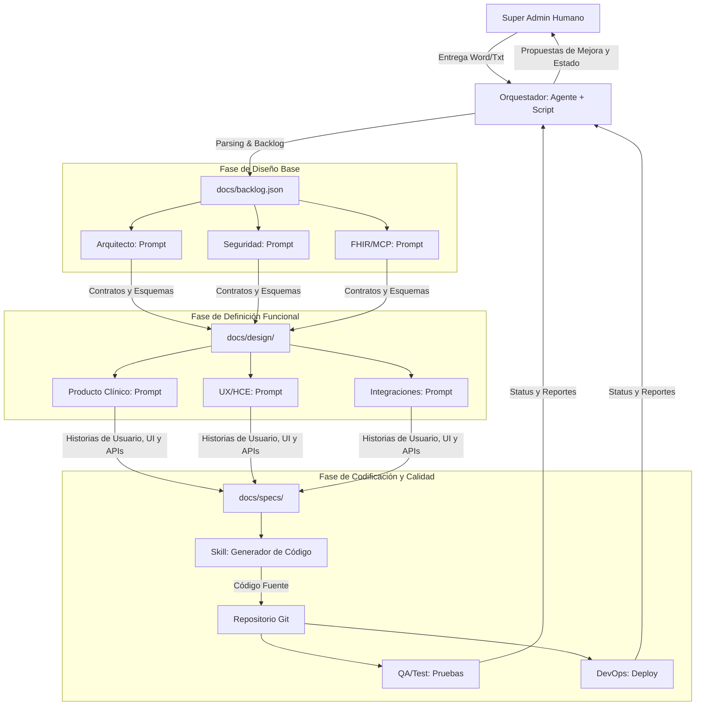

# Plan de Implementación Unificado - Estructura de Orquestación de Agentes de IA para HCE

Este plan define el diseño técnico, la arquitectura de archivos, los roles, las habilidades (skills), los protocolos y el flujo operativo paso a paso para establecer un equipo de agentes de IA coordinados. El sistema integra un motor real de ejecución (Script de Orquestación + Agente) capaz de procesar requerimientos de salud, generar un backlog físico, coordinar agentes conceptuales, implementar código compatible con HL7 FHIR bajo políticas Zero Trust y realizar el despliegue automático bajo el control del Super Administrador.

---

## 🛠️ Arquitectura del Centro de Mando Activo (Opción 2)

El flujo de comunicación y control en tiempo real entre el usuario y los agentes de IA se estructura de la siguiente manera:



### Endpoints de la API local en Python:
1. **`GET /api/backlog`**: Retorna el contenido del archivo `docs/backlog.json` (listado de tareas y su historial de auditoría de agentes).
2. **`POST /api/action`**: Gatilla el inicio del flujo del Orquestador para un módulo o tarea específica.
   * *Payload:* `{"action": "develop" | "audit" | "test" | "deploy", "module_id": number | string, "task_id": string}`
3. **`GET /api/events`**: Endpoint de Server-Sent Events (SSE) para enviar en tiempo real las bitácoras y pensamientos de los agentes de IA a la consola web.
4. **`POST /api/approve`**: Envía la confirmación del Super Administrador para desbloquear una tarea en pausa (HITL).
   * *Payload:* `{"task_id": "string", "approved": boolean, "comments": "string"}`

---

## 1. Estructura de Roles de Agentes y Contratos de Comunicación

Para evitar errores y solapamientos de responsabilidades entre los roles conceptuales de los agentes de IA, cada uno de ellos operará strictly dentro de su dominio mediante un contrato de comunicación JSON formal que el script orquestador procesará.



### 1.1 Definición Detallada de Agentes

1. **Agente Orquestador (Agente + Script de Orquestación):**
   * **Rol:** Controla el ciclo de vida del desarrollo. Parsea el requerimiento clínico, crea el backlog en `docs/backlog.json`, asigna subtareas, recolecta respuestas y las consolida.
   * **Límites:** No escribe código de aplicación ni define políticas de seguridad. Solo coordina e interactúa con el Super Administrador.
   * **Contrato de Salida (Asignación de Tarea):** `{ "task_id": "string", "modulo": "string", "asignatarios": ["string"], "contexto_tarea": "string" }`

2. **Agente Arquitecto:**
   * **Rol:** Diseña la arquitectura técnica de la HCE, base de datos (PostgreSQL), mensajería (Kafka/RabbitMQ) y microservicios.
   * **Límites:** No decide reglas de seguridad (Keycloak) ni el diseño de pantallas (UX).
   * **Contrato de Salida (Diseño):** `{ "arquitectura": { "patron": "string", "base_datos": "string", "endpoints": [{ "path": "string", "method": "string", "request_body": "string" }] } }`

3. **Agente FHIR/MCP:**
   * **Rol:** Mapea flujos clínicos a recursos estándar HL7 FHIR R4/R5 (Patient, Encounter, Observation, Condition, MedicationRequest, etc.) y diseña los esquemas para las herramientas del Servidor MCP.
   * **Límites:** No define tecnologías de red, bases de datos o middlewares.
   * **Contrato de Salida (Mapeo):** `{ "mapeo_fhir": { "recurso": "string", "campos_mapeados": {}, "mcp_tools": [{ "name": "string", "params": {} }] } }`

4. **Agente Seguridad y Compliance:**
   * **Rol:** Diseña los controles Zero Trust, autenticación (Keycloak/OIDC), cifrado (reposo TDE / mTLS interno) y logs de auditoría inmutables (HIPAA/GDPR).
   * **Límites:** No define la UI ni flujos de negocio del producto.
   * **Contrato de Salida (Seguridad):** `{ "politicas_seguridad": { "auth": "string", "roles_admitidos": ["string"], "auditoria": "string", "segmentacion_red": "string" } }`

5. **Agente de Producto Clínico:**
   * **Rol:** Define la lógica asistencial. Traduce las necesidades de médicos y enfermeros en historias de usuario estructuradas y criterios de aceptación funcionales.
   * **Límites:** No escribe código ni configura infraestructuras.
   * **Contrato de Salida (HU):** `{ "user_story": { "titulo": "string", "como": "string", "quiero": "string", "para": "string", "criterios_aceptacion": ["string"] } }`

6. **Agente UX/HCE:**
   * **Rol:** Diseña los wireframes, flujo de pantallas de la interfaz gráfica y atajos de teclado para optimizar la usabilidad médica (evitando el "EHR burnout").
   * **Límites:** No define APIs ni lógica de datos.
   * **Contrato de Salida (UX):** `{ "pantalla": "string", "componentes": ["string"], "accesibilidad": "string", "atajos_teclado": {} }`

7. **Agente de Integraciones:**
   * **Rol:** Diseña y construye conectores robustos con sistemas legacy de salud (HL7 v2.x para LIS, DICOM para PACS/imágenes, y REST/JSON para seguros gubernamentales).
   * **Límites:** No modifica el núcleo de datos de la HCE.
   * **Contrato de Salida (Conector):** `{ "integracion": { "sistema_destino": "string", "protocolo": "string", "endpoint_mcp": "string" } }`

8. **Agente QA/Test:**
   * **Rol:** Genera y ejecuta casos de prueba funcionales, de integración, rendimiento y validación sintáctica/semántica de esquemas FHIR.
   * **Límites:** No tiene permiso de liberar a producción directamente.
   * **Contrato de Salida (Tests):** `{ "test_report": { "cobertura_codigo": "string", "casos_exito": 0, "casos_fallidos": 0, "validaciones_fhir": "string" } }`

9. **Agente DevOps/Release:**
   * **Rol:** Define los contenedores (Docker), orquestadores (Kubernetes/Helm), pipelines de CI/CD y monitoreo de la salud de los servicios (Prometheus/Grafana).
   * **Límites:** No realiza cambios funcionales en el código fuente clínico.
   * **Contrato de Salida (Despliegue):** `{ "despliegue": { "imagenes_docker": ["string"], "orquestacion": "string", "pipeline_cicd": "string" } }`

---

## 2. Especificación de Skills Operativos (Habilidades)

Los skills son metodologías y scripts de automatización estructurados que el Orquestador ejecuta a través del script de control para manipular el repositorio.

1. **`skill_requirements_parser`:** Toma el texto de la especificación clínica y lo segmenta mediante LLM en módulos funcionales y no funcionales, asignando tareas específicas a cada rol y generando `docs/backlog.json`.
2. **`skill_design_validator`:** El script evalúa de forma cruzada los diseños de Arquitectura, Seguridad y FHIR en `docs/design/`, verificando que cumplan con las directrices de seguridad (mTLS, segmentación, OAuth2) e interoperabilidad FHIR.
3. **`skill_code_generator`:** El motor de andamiaje lee las especificaciones y diseños aprobados, generando la estructura modular del backend (NestJS/FastAPI) y frontend (React), con validaciones OIDC y esquemas FHIR.
4. **`skill_security_audit`:** Realiza auditorías automatizadas del código (SAST, análisis de dependencias vulnerables, escaneo de secretos y validación de políticas de acceso).
5. **`skill_testing_and_ci`:** Corre los tests unitarios y de integración, valida los JSON generados contra el validador oficial de HL7 FHIR y genera las configuraciones Docker y Kubernetes.

---

## 3. Flujo Técnico Paso a Paso (Del Word al Despliegue en 11 Pasos)

1. **Paso 1: Ingesta del Documento de Especificaciones:** El Super Admin inicia el script `scripts/orchestration_runner.py` pasándole la ruta de la especificación técnica (`HCE_Analisis_Funcional_Mejorado_2025.txt`).
2. **Paso 2: Parsing y Creación del Backlog:** El script ejecuta `skill_requirements_parser`, clasificando requerimientos y escribiendo `docs/backlog.json`.
3. **Paso 3: Aprobación del Backlog (HITL):** El script pausa su ejecución y solicita la confirmación física del Super Administrador para iniciar el diseño.
4. **Paso 4: Fase de Diseño Técnico Base:** El script invoca los prompts del Arquitecto, Seguridad y FHIR/MCP, generando los planos en `docs/design/`.
5. **Paso 5: Fase de Definición Funcional y UX:** El script asigna tareas a Producto, UX e Integraciones para documentar historias de usuario, mockups y conectores de API en `docs/specs/`.
6. **Paso 6: Aprobación de Especificaciones (HITL):** El script pausa su ejecución para que el Super Administrador apruebe las especificaciones y contratos de API.
7. **Paso 7: Generación de Código:** El script ejecuta `skill_code_generator`, escribiendo los archivos de código de backend (servicios, controladores FHIR) y frontend (pantallas con atajos de teclado y offline).
8. **Paso 8: Auditoría de Seguridad Automatizada:** El agente de Seguridad valida el código mediante `skill_security_audit` para garantizar Zero Trust y protección de ePHI.
9. **Paso 9: Pruebas y Validación de Calidad:** QA/Test corre las pruebas mediante `skill_testing_and_ci`, validando la API contra esquemas FHIR.
10. **Paso 10: Configuración de CI/CD e Infraestructura:** El agente DevOps genera los Dockerfiles, Helm Charts y pipelines de GitHub Actions.
11. **Paso 11: Despliegue y Aprobación Final:** La HCE se despliega en un cluster de Staging. El script muestra la URL y los reportes de calidad, finalizando tras la aprobación del Super Administrador.

---

## 4. Propuestas de Mejora del Estado del Arte

* **SMART on FHIR Launch:** Implementar el flujo OAuth2 de SMART on FHIR en Keycloak para permitir integraciones de terceros seguras y acotadas.
* **Motor Terminológico en MCP:** Integrar un servidor terminológico en el Servidor MCP para mapear automáticamente lenguaje natural a códigos CIE-10/SNOMED CT en tiempo real.
* **Service Mesh (mTLS):** Utilizar Linkerd o Istio en Kubernetes para automatizar la segmentación de red Zero Trust a nivel de infraestructura, encriptando todo el tráfico interno.

---

## 5. Cambios Físicos Propuestos en el Repositorio

Implementaremos los directorios y archivos correspondientes al flujo operativo:

```
d:\APP julio   - NO BORRAR-\APP historia clinica
├── AGENTS.md (modificado)
├── dashboard.html (modificado)          <-- UI con consola de terminal y conexión HTTP local
├── scripts [NUEVO]
│   └── orchestration_runner.py [NUEVO]  <-- El servidor API local de Python
├── docs
│   ├── backlog.json [NUEVO]             <-- Fuente de verdad del estado de tareas e historias
│   ├── agents (nuevo directorio)
│   │   ├── orchestrator.md (movido y refinado con inputs/outputs exactos)
│   │   ├── architect.md (movido y refinado)
│   │   ├── fhir-mcp.md (movido y refinado)
│   │   ├── security.md (movido y refinado)
│   │   ├── product.md (movido y refinado)
│   │   ├── ux.md (movido y refinado)
│   │   ├── integrations.md (movido y refinado)
│   │   ├── qa.md (movido y refinado)
│   │   └── devops.md (movido y refinado)
│   ├── skills
│   │   ├── skill_requirements_parser.md [NUEVO]
│   │   ├── skill_code_generator.md [NUEVO]
│   │   ├── skill_security_audit.md [NUEVO]
│   │   └── skill_orchestration_loop.md [NUEVO]
│   ├── mcp
│   │   └── mcp-spec.md [NUEVO]
│   └── protocol
│       └── orchestration_protocol.md [NUEVO]
└── diagrams
    └── agent_interaction.mmd [NUEVO]
```

---

## 6. Plan de Verificación

### Verificación Automatizada
- Pruebas sintácticas y de importación de librerías sobre `orchestration_runner.py`.
- Validación sintáctica de la estructura JSON del backlog (`backlog.json`).

### Verificación Manual
- Inicialización del servidor API en puerto `8000`.
- Carga de la interfaz `dashboard.html` en Chrome, verificando la conexión automática y la visualización de las tareas y el estado de vinculación (`⚡ Vinculado al servidor local`).
- Simulación de detonación de acción (desarrollo del Módulo 0) mediante la interfaz gráfica del Dashboard y visualización de logs en la consola web.

---

## 🎨 ANEXO: Rediseño Estético e Hiperrealismo del Odontograma Dental

El usuario ha reportado que la representación actual del diente sigue siendo esquemática y carece de realismo estético. Para lograr un acabado fotorrealista y de calidad profesional médica (morfología dental fiel), implementaremos las siguientes mejoras anatómicas avanzadas:

### 1. Modelado 3D Procedural Avanzado en Three.js (Opción B)
Para superar las limitaciones del cubo plano deformado de forma tosca, se implementará una simulación procedural de alta densidad poligonal:
- **Geometría de Alta Resolución:** Incrementaremos la segmentación de la caja (`THREE.BoxGeometry(1.6, 1.2, 1.6, 30, 30, 30)`) para disponer de más de 2,700 vértices interactivos.
- **Escultura por Ecuaciones Gaussianas (Cúspides Dentales):** En lugar de deformaciones lineales, se modelarán las cúspides superiores utilizando cúpulas gaussianas redondeadas, eliminando esquinas rígidas:
  $$y_{nuevo} = y + \sum_{j=1}^{4} H \cdot e^{-\frac{(x - x_j)^2 + (z - z_j)^2}{2\sigma^2}}$$
  Donde $H = 0.38$ es la altura de la cúspide, $\sigma = 0.28$ es el radio de curvatura y $(x_j, z_j)$ son las 4 esquinas oclusales del molar: $(0.45, 0.45)$, $(0.45, -0.45)$, $(-0.45, 0.45)$, y $(-0.45, -0.45)$.
- **Tallado de Surcos y Fisuras Oclusales (En V):** Se esculpirá la fosa central y los surcos principales (mesiodistal y vestibulolingual) aplicando una función de atenuación matemática en forma de V:
  $$y_{nuevo} = y_{nuevo} - 0.22 \cdot e^{-\frac{x^2}{2 \cdot 0.08^2}} - 0.22 \cdot e^{-\frac{z^2}{2 \cdot 0.08^2}}$$
- **Inflado Convexo de la Corona (Forma de Barril):** Para imitar la silueta abombada natural de la corona dental, se aplicará un inflado senoidal lateral en el perfil del diente:
  $$x_{nuevo} = x \cdot (1.0 + 0.18 \cdot \cos(\pi \cdot y))$$
  $$z_{nuevo} = z \cdot (1.0 + 0.18 \cdot \cos(\pi \cdot y))$$
- **Mapa de Normales Procedural (Relieve y Oclusión):** Crearemos dinámicamente un canvas 2D con un gradiente de relieve (ruido de esmalte + surcos oscuros) y lo cargaremos como un `THREE.CanvasTexture` en la propiedad `.bumpMap` o `.normalMap` de los materiales. Esto generará sombras de oclusión realistas en los surcos al reaccionar con la iluminación del estudio 3D, acentuando la tridimensionalidad clínica de la pieza.

### 2. Rediseño del SVG Anatómico de Alta Definición (Opción A)
Para la Opción A, rediseñaremos por completo las curvas vectoriales (Bézier) para representar fielmente la anatomía clínica:
- **Perfil de la Corona Molar Frontal:** Reemplazaremos la silueta plana por un contorno ondulado con tres lóbulos superiores redondeados (cúspides) y una línea cervical (cuello) sinuosa y realista.
- **Detalle de la Vista Oclusal:** Dibujaremos surcos de desarrollo sinuosos y fosas secundarias internas utilizando gradientes radiales oscuros para emular profundidad.
- **Brillo Especular de Esmalte (Specular Gloss):** Agregaremos múltiples elipses semitransparentes con máscaras de desvanecimiento (`feGaussianBlur`) para simular la luz rebotando en una superficie dental húmeda e inmaculada.
- **Profundidad de Raíces:** Las raíces tendrán un sombreado degradado cilíndrico en 3D que se difumina hacia el ápice, con canales radiculares finamente delineados.

---

## 📅 Plan de Verificación

### Verificación Automatizada
- Pruebas sintácticas en el script JavaScript de renderizado para evitar errores de sintaxis al evaluar las funciones gaussianas de deformación de malla.
- Validación de que los materiales de Three.js no lancen advertencias por parámetros incorrectos en la consola WebGL.

### Verificación Manual
- Despliegue de la demo en el servidor Vite local e inspección visual en Chrome.
- Captura de pantalla y grabación de la interacción del molar con el material y sombreado procedural de normales activos para certificar el realismo estético final con el usuario.
